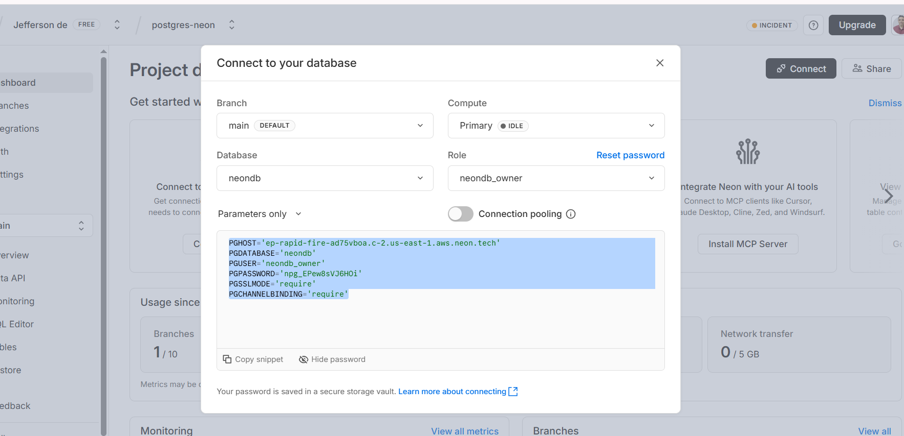
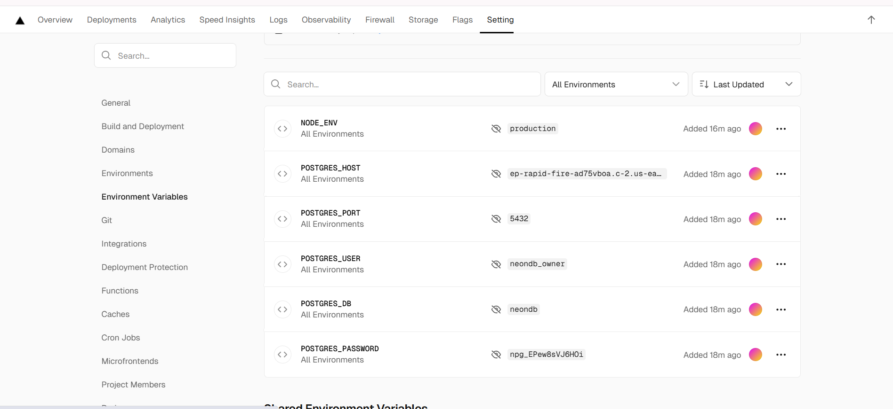

# `dotenv` ou variáveis de ambiente (.env).

- Como estamos usando o `Docker` para rodar o banco de dados `PostgreSQL`, precisamos configurar algumas variáveis de ambiente para que o banco funcione corretamente. Essas variáveis são usadas para definir o nome do banco de dados, o usuário, a senha e outras configurações necessárias para o `PostgreSQL`.

## 1. O que são variáveis de ambiente?

- Variáveis de ambiente são pares chave-valor que podem ser usados para configurar o comportamento de aplicativos e serviços sem alterar o código-fonte. Elas são frequentemente usadas para armazenar informações sensíveis, como credenciais de banco de dados, chaves de API e configurações específicas do ambiente (desenvolvimento, teste, produção).

- Um arquivo `.env` é um arquivo de texto simples que contém variáveis de ambiente em formato chave-valor. Ele é usado para definir essas variáveis de ambiente de forma fácil e organizada. O arquivo `.env` geralmente é colocado na raiz do projeto e não deve ser incluído no controle de versão (como Git) para proteger informações sensíveis.

## Como usar um arquivo `.env`?

- Para usar um arquivo `.env`, você pode seguir estes passos:

1. Crie um arquivo chamado `.env` na raiz do seu projeto.

2. Adicione suas variáveis de ambiente no formato `CHAVE=valor`, uma por linha. Por exemplo:

   ```yaml
   POSTGRES_HOST=localhost
   POSTGRES_PORT=5432
   POSTGRES_USER=meu_usuario
   POSTGRES_DB=meu_banco
   POSTGRES_PASSWORD=minha_senha
   ```

3. Configure seu aplicativo ou serviço para carregar as variáveis de ambiente do arquivo `.env`.

- No caso do Docker Compose, você pode usar a diretiva `env_file` no seu arquivo `compose.yaml` para especificar o arquivo `.env` que contém as variáveis de ambiente. Por exemplo:

```yaml
services:
  database:
    image: "postgres:16.0-alpine3.18"
    env_file:
      - ../.env
    ports:
      - "5432:5432"
```

## 2. EM NOSSO PROJETO VAMOS CONFIGURAR O NOSSO AMBIENTE DE HOMOLOGAÇÃO:

- 1. Crie um arquivo `.env` na raiz do projeto com o seguinte conteúdo:

```yaml
POSTGRES_HOST=localhost # Nome padrão do host do banco de dados que vem do postgres
POSTGRES_PORT=5432 # Porta padrão do postgres
POSTGRES_USER=local_user # Nome do usuário do banco de dados
POSTGRES_DB=local_db # Nome do banco de dados
POSTGRES_PASSWORD=local_password # Senha do usuário do banco de dados que definimos para o serviço de homologação
```

- 2. Atualize o arquivo `compose.yaml` para usar o arquivo `.env`:
  - Antes estava assim:

  ```yaml
  services:
    database:
      image: "postgres:16.0-alpine3.18"
      environment:
        POSTGRES_PASSWORD: "local_password"
      ports:
        - "5432:5432"
  ```

  - Agora deve ficar assim:

  ```yaml
  services:
    database:
      image: "postgres:16.0-alpine3.18"
      env_file:
        - ../.env.development
      ports:
        - "5432:5432"
  ```

- 3. Atualize o arquivo `database.js` para usar as variáveis de ambiente do arquivo `.env`:

```javascript
import { Client } from "pg"; // Importa o cliente do PostgreSQL

async function query(queryObject) {
  // Criando a função query que recebe um objeto de consulta
  const client = new Client({
    // Cria uma nova instância do cliente do PostgreSQL
    host: process.env.POSTGRES_HOST, // Usa a variável de ambiente para o host
    port: process.env.POSTGRES_PORT, // Usa a variável de ambiente para a porta
    user: process.env.POSTGRES_USER, // Usa a variável de ambiente para o usuário
    database: process.env.POSTGRES_DB, // Usa a variável de ambiente para o banco de dados
    password: process.env.POSTGRES_PASSWORD, // Usa a variável de ambiente para a senha
  });
  await client.connect(); // Conecta ao banco de dados
  const result = await client.query(queryObject); // Executa a consulta passada como argumento
  await client.end(); // Encerra a conexão com o banco de dados
  return result; // Retorna o resultado da consulta
}

export default { query: query }; // Exporta a função query para ser usada em outros arquivos
```

- 4. Atualmente a resposta do `endpoint` do arquivo `pages/api/v1/status/index.js` de status está assim:

```javascript
import database from "../../../../infra/database.js"; // Importa o módulo de banco de dados de forma relativa

async function status(requerest, response) {
  // Define a função assíncrona status que recebe os objetos request e response
  const result = await database.query("SELECT 10 + 7 AS SOMA;"); // Executa uma consulta SQL simples para testar a conexão com o banco de dados
  console.log(result.rows[0]); // Loga o resultado da consulta no console
  response.status(200).json({ chave: "(200) - Meu status está ok!" }); // Envia uma resposta JSON com status 200
}

export default status; // Exporta a função status para ser usada em outros arquivos
```
## 3 Na variável de ambiente `POSTGRES_HOST` você pode usar o host do banco de dados que está rodando no seu computador local ou o host do banco de dados na nuvem, como o Neon.

- 1. O dados do banco de dados no Neon são:

```yaml
POSTGRES_HOST=ep-rapid-fire-ad75vboa.c-2.us-east-1.aws.neon.tech
POSTGRES_PORT=5432
POSTGRES_USER=neondb_owner
POSTGRES_DB=neondb
POSTGRES_PASSWORD=npg_EPew8sVJ6HOi
```

- 2. E porque fizemos isso?


  - Porque assim podemos alternar facilmente entre diferentes ambientes (desenvolvimento local e produção na nuvem) apenas alterando o arquivo `.env.development` ou as variáveis de ambiente, sem precisar modificar o código-fonte do aplicativo. Isso torna o processo de desenvolvimento e implantação mais flexível e seguro.


## 4. Configurando SSL para produção

- 1. No site da Neon, o banco de dados exige uma conexão segura (SSL) para se conectar ao banco de dados. Portanto, precisamos configurar o cliente do PostgreSQL para usar SSL quando estivermos em um ambiente de produção. E lá ele ofereceu algo do banco gratuito:

```yaml
PGHOST='ep-rapid-fire-ad75vboa.c-2.us-east-1.aws.neon.tech'
PGDATABASE='neondb'
PGUSER='neondb_owner'
PGPASSWORD='npg_EPew8sVJ6HOi'
PGSSLMODE='require'
PGCHANNELBINDING='require'
```
-  E aqui um cuidado pois os valores que precisamos são: `(PGHOST, PGDATABASE, PGUSER, PGPASSWORD)` que representam respectivamente `(POSTGRES_HOST, POSTGRES_DB, POSTGRES_USER, POSTGRES_PASSWORD)` e então pegamos somente os valores que precisamos e colocamos no nosso arquivo `.env.development` ou `.env.production`:

```yaml
POSTGRES_HOST=ep-rapid-fire-ad75vboa.c-2.us-east-1.aws.neon.tech
POSTGRES_PORT=5432
POSTGRES_USER=neondb_owner
POSTGRES_DB=neondb
POSTGRES_PASSWORD=npg_EPew8sVJ6HOi
NODE_ENV=production
```

- A variável `NODE_ENV` é uma convenção amplamente utilizada na comunidade de desenvolvimento para indicar o ambiente em que a aplicação está sendo executada. Ela pode assumir diferentes valores, como `development`, `production`, `test`, entre outros, dependendo do estágio do ciclo de vida da aplicação.

- 2. No site da Neon, o banco de dados exige uma conexão segura (SSL) para se conectar ao banco de dados. Portanto, precisamos configurar o cliente do PostgreSQL para usar SSL quando estivermos em um ambiente de produção. Então pegamos as variáveis e iremos inserir no site `vercel` na seção de variáveis de ambiente do projeto.

- No site da `neon`:
  - 

- No site da `vercel`:
  - 

- 3. Atualize o arquivo `database.js` para configurar o SSL com base no ambiente:

```javascript
import { Client } from "pg"; // Importa o cliente do PostgreSQL
async function query(queryObject) {
  // Criando a função query que recebe um objeto de consulta
  const client = new Client({
    // Cria uma nova instância do cliente do PostgreSQL
    host: process.env.POSTGRES_HOST, // Usa a variável de ambiente para o host
    port: process.env.POSTGRES_PORT, // Usa a variável de ambiente para a porta
    user: process.env.POSTGRES_USER, // Usa a variável de ambiente para o usuário
    database: process.env.POSTGRES_DB, // Usa a variável de ambiente para o banco de dados
    password: process.env.POSTGRES_PASSWORD, // Usa a variável de ambiente para a senha
    ssl: process.env.NODE_ENV === "development" ? false : true, // Configura SSL com base no ambiente
  });
  await client.connect(); // Conecta ao banco de dados
  const result = await client.query(queryObject); // Executa a consulta passada como argumento
  await client.end(); // Encerra a conexão com o banco de dados
  return result; // Retorna o resultado da consulta
}

export default { query: query }; // Exporta a função query para ser usada em outros arquivos
```

- Agora resta fazer somente saber em qual tipo de banco estamos rodando, se é local ou na nuvem. E para isso usamos a variável de ambiente `NODE_ENV` que definimos no arquivo `.env.development`.

